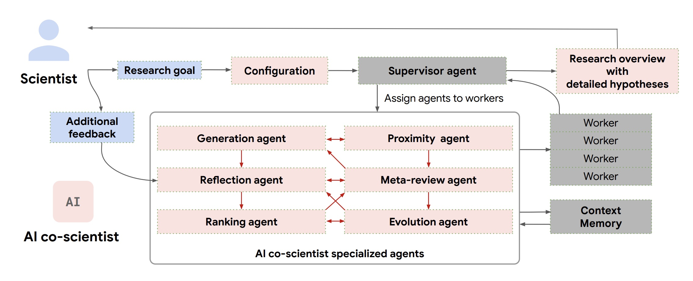

  [](https://www.typescriptlang.org/)
  [](https://mastra.ai/)
  [](https://sdk.vercel.ai/)
  [](https://github.com/vincenzodomina/open-co-scientist/stargazers)
  [](https://opensource.org/licenses/MIT)
  [](CONTRIBUTING.md)


# 🔬 Open Co Scientist

<div align="center">
  
  
  
  *AI co-scientist system overview [1]*
  
</div>

Given a scientist’s research goal that has been specified in natural language, the AI co-scientist is designed to generate novel research hypotheses, a detailed research overview, and experimental protocols. To do so, it uses a coalition of specialized agents — Generation, Reflection, Ranking, Evolution, Proximity and Meta-review — that are inspired by the scientific method itself. These agents use automated feedback to iteratively generate, evaluate, and refine hypotheses, resulting in a self-improving cycle of increasingly high-quality and novel outputs.

## 🧠 Vision

**Open Co Scientist** aims to democratize scientific research by providing an open-source implementation of an AI co-scientist system. 

This project is an open-source recreation of the concepts described in Google's "Towards an AI co-scientist" paper [1], adapting its powerful multi-agent architecture for public use using modern TypeScript, the Mastra.ai agent framework, and the Vercel AI SDK.

## 🌟 How it works

Purpose-built for collaboration, scientists can interact with the system in many ways, including by directly providing their own seed ideas for exploration or by providing feedback on generated outputs in natural language. The AI co-scientist also uses tools, like web-search and specialized AI models, to enhance the grounding and quality of generated hypotheses.

Open Co Scientist employs a "generate, debate, evolve" approach through a coordinated system of specialized AI agents:

### 🤖 Multi-Agent Architecture

- **Supervisor Agent**: Orchestrates the entire research process, manages resource allocation, and coordinates specialized agents
- **Generation Agent**: Creates initial hypotheses aligned with research goals by exploring literature and synthesizing existing findings
- **Reflection Agent**: Critically evaluates hypotheses for correctness, quality, and novelty using multi-stage review processes
- **Ranking Agent**: Employs an Elo-based tournament system with pairwise comparisons to assess and prioritize hypotheses
- **Proximity Agent**: Creates proximity graphs to cluster similar ideas, enabling efficient exploration of the hypothesis space
- **Evolution Agent**: Continuously refines promising hypotheses through various improvement strategies
- **Meta-Review Agent**: Synthesizes insights across reviews to optimize agent performance and summarize findings

### 🔄 Research Workflow

1. Scientists provide research goals or even seed ideas in natural language
2. The Supervisor Agent parses the assigned goal into a research plan configuration
3. The Supervisor agent assigns the specialized agents to the worker queue and allocates resources. 
4. Specialized agents generate, evaluate, rank, and refine hypotheses
5. Scientists receive comprehensive research overviews with testable hypotheses

### 🛠️ Key Capabilities

- Literature exploration and knowledge synthesis
- Hypothesis generation and refinement
- Scientific debate simulation
- Automated peer review processes
- Collaborative human-AI research

## 🚀 Getting Started

### Prerequisites

- Node.js (v18 or higher)
- npm (v10 or higher)
- OpenAI API key

```bash
# Clone the repository
git clone https://github.com/vincenzodomina/open-co-scientist.git
cd open-co-scientist

# Install dependencies
npm install

# Run the development server
npm run dev
```

## 📚 Usage

- Open the Mastra AI Playground
- Chat with the co-scientist agent or kick of the research workflow
- Type in your research goal and let the co-scientist generate

## 🧩 Architecture

Open Co Scientist follows a multi-agent architecture where specialized agents work together in a coordinated workflow:

```
┌─────────────────┐
│                 │
│    Scientist    │
│                 │
└────────┬────────┘
         │
         ▼
┌─────────────────┐
│                 │
│    Supervisor   │
│      Agent      │
│                 │
└────────┬────────┘
         │
         ▼
┌────────┴────────┐
│  Worker Process │
│     Queue       │
└┬───────┬───────┬┘
 │       │       │
 ▼       ▼       ▼
┌─────┐ ┌─────┐ ┌─────┐
│Gen. │ │Refl.│ │Rank.│
│Agent│ │Agent│ │Agent│
└──┬──┘ └──┬──┘ └──┬──┘
   │       │       │
   ▼       ▼       ▼
┌─────┐ ┌─────┐ ┌─────┐
│Prox.│ │Evol.│ │Meta │
│Agent│ │Agent│ │Agent│
└─────┘ └─────┘ └─────┘
```

## 🤝 Contributing

We welcome contributions from researchers, developers, and enthusiasts! Whether you're interested in improving the core architecture, enhancing agent capabilities, or adding new features, your input is valuable.

See our [CONTRIBUTING.md](CONTRIBUTING.md) for guidelines on how to get started.

## 💻 Tech Stack

- **TypeScript**: Because we had enough of Python
- **Mastra.ai Agent Framework**: Awesome foundation for our multi-agent architecture
- **Vercel AI SDK**: Takes care of the integration with various LLM providers
- **React & Next.js**: Powers the web interface for the Mastra AI Playground

### Areas Seeking Contribution

- **Agent Implementation**: Develop and improve specialized agents using the Mastra.ai framework
- **Literature Search**: Integrate with open academic databases and APIs
- **Knowledge Graphs**: Build tools for representing scientific knowledge
- **Evaluation**: Create TypeScript benchmarks for hypothesis quality assessment
- **User Interface**: Enhance the React frontend for intuitive scientist interaction
- **Documentation**: Improve guides, tutorials, and TypeScript examples
- **API Integration**: Add support for additional LLM providers through Vercel AI SDK

## 📄 License

This project is licensed under the MIT License - see the [LICENSE](LICENSE) file for details.

## 🙏 Acknowledgments

This project draws inspiration from Google's "Towards an AI co-scientist" paper. We aim to recreate and extend these capabilities in an open-source framework, making AI-assisted scientific discovery accessible to everyone.

## References

[1] Gottweis, J., Weng, W.-H., et al. (2025). [Towards an AI co-scientist](https://storage.googleapis.com/coscientist_paper/ai_coscientist.pdf).

## 📞 Contact

- GitHub Issues: [https://github.com/vincenzodomina/open-co-scientist/issues](https://github.com/vincenzodomina/open-co-scientist/issues)

---

<div align="center">
  <p>Accelerating scientific discovery through collaborative AI</p>
</div>